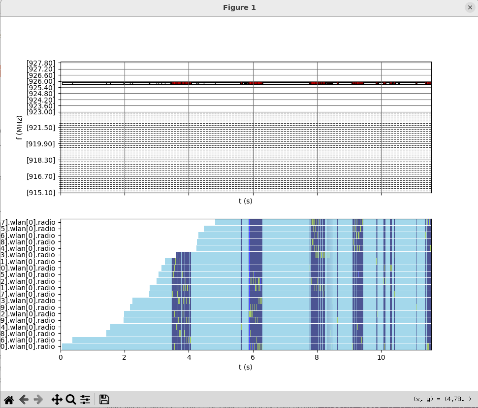

# CSMA Contiki-NG Example

A 20-node RPL/UDP network over CSMA. No network server, no Docker, no campaign machinery —
the smallest example in the set and the best one to learn the simulator on.

It is **not** part of the paper's reproduction: it uses the model's own sandbox
`simulations/wireless/nic/labscim.ini` rather than the pinned files under `inis/`, and there
is no runner script for it. Requires the [installation guide](INSTALLATION.md).

### 1. Build the firmware
```bash
cd $LABSCIM_WORKSPACE_ROOT/contiki-ng/examples/rpl-udp && make -j$(nproc) TARGET=labscim
```

Produces `udp-client.labscim` and `udp-server.labscim`. This example builds out of
`contiki-ng/`, the tree the model itself compiles against — unlike the 6TiSCH campaign
firmware, which comes from `contiki-ng-labscim-tsch/`.

### 2. Configure
The configuration is `[Config ContikiNGTest]` in
`models/labscim/simulations/wireless/nic/labscim.ini`, with 20 Contiki-NG hosts and no LoRa
hosts. Switch the firmware selection from 6TiSCH `simple-node` to the `rpl-udp` pair:

```ini
*.contikinghost[0].wlan[*].mac.TSCHCoordinator = true
*.contikinghost[*].wlan[*].mac.BootTime = uniform(0.1s,5s)
*.contikinghost[0].wlan[*].mac.NodeProcessCommand="$LABSCIM_WORKSPACE_ROOT/contiki-ng/examples/rpl-udp/udp-server.labscim"
*.contikinghost[*].wlan[*].mac.NodeProcessCommand="$LABSCIM_WORKSPACE_ROOT/contiki-ng/examples/rpl-udp/udp-client.labscim"
#*.contikinghost[*].wlan[*].mac.NodeProcessCommand="$LABSCIM_WORKSPACE_ROOT/contiki-ng/examples/6tisch/simple-node/node.labscim"
```

Order matters: OMNeT++ applies the first matching pattern, so the `[0]` line must come before
the `[*]` line for the server to differ from the clients.

> The shipped file still uses `$HOME/LabSCim/...`, unlike the campaign files under `inis/`.
> Substitute the paths as above, or the run hangs at `Initializing...`.

### 3. Run
```bash
cd $LABSCIM_WORKSPACE_ROOT && source scripts/env.sh
cd "$NIC_DIR" && "$MODEL_BIN" -u Cmdenv -c ContikiNGTest \
    --network=tsch.simulations.wireless.nic.LabSCim \
    -n "../..:../../../src:$INET_ROOT/src" \
    --image-path="$INET_ROOT/images" \
    labscim.ini
```

Sourcing `scripts/env.sh` resolves `MODEL_BIN`, `INET_ROOT` and `LABSCIM_WORKSPACE_ROOT`.
This configuration uses port 9608, so make sure no campaign is on it.

To run it from the IDE instead, see [INSTALLATION_IDE.md](INSTALLATION_IDE.md) — that is
also where firmware debugging with `NodeDebug` is described, which is most useful on a small
example like this one.

### 4. Plot spectrum usage
Enable the recorder for the run:

```ini
*.spectrumrecorder.EnableLog = true
```

```bash
cd $LABSCIM_WORKSPACE_ROOT
./scripts/plot_spectrum.sh -f <path-to-spectrumUsage.txt> -t 242,242.5 -o spectrum.png
```

`-f` names the usage log (the companion `*-spectrumPower.txt` is inferred), `-d` picks the
newest in a directory, and `-o` writes a PNG instead of opening a window. Zoom the time
axis — a frame lasts about 2 ms, so a whole run shows nothing.



### Next steps

For the scenarios the paper reports, continue with the
[6TiSCH campaign](EXAMPLE_6TiSCH_CONTIKI.md).
