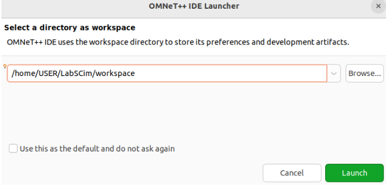
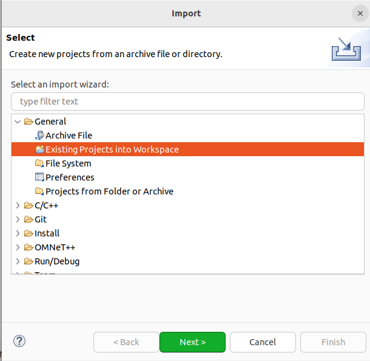
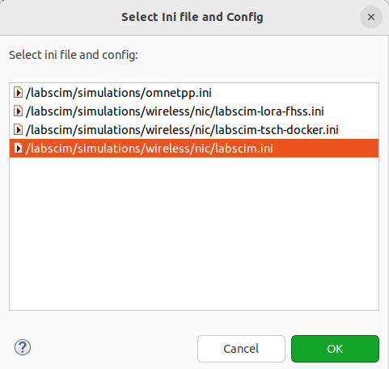
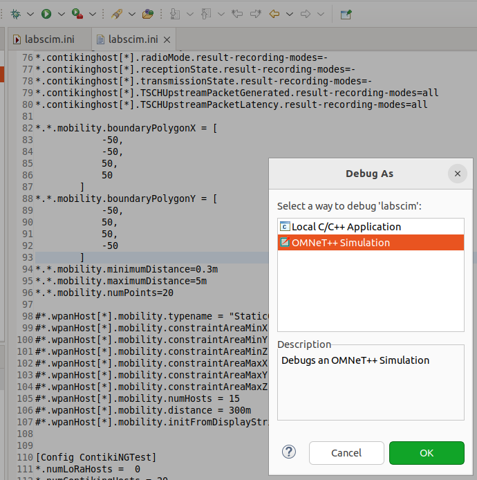

# Working from the OMNeT++ IDE

The [installation guide](INSTALLATION.md) builds everything for headless campaign runs. This
guide adds what the IDE needs: a graphical runtime, debug builds, and the project wiring.

Follow [INSTALLATION.md](INSTALLATION.md) first — this replaces only two of its steps and
adds the rest.

## Step 1: Install the Qt Packages
OMNeT++ 6.4 builds Qtenv against **Qt6**. The Qt5 packages are not a substitute:

```bash
sudo apt install -y qt6-base-dev qt6-base-dev-tools qt6-tools-dev \
    qt6-tools-dev-tools libwebkit2gtk-4.1-0 xdg-utils
```

If Qt5 is already installed, `./configure` fails with `qmake: could not find a Qt
installation of '6'` followed by `Could not find all of moc, rcc, and uic for Qt6`. That is
this step being skipped: `configure` tries `qmake6`, `qmake-qt6`, then plain `qmake`, and the
last one is Qt5's. Installing Qt6 alongside Qt5 is enough — nothing needs to be removed, and
`PATH` and `qtchooser` need no adjustment, because `configure` then locates `moc`/`rcc`/`uic`
under the directories `qmake6` reports.

For 3D scene visualization, also `sudo apt install libopenscenegraph-dev`.

## Step 2: Rebuild OMNeT++ with Qtenv
The headless guide sets `WITH_QTENV=no`, which leaves you without a graphical runtime.
Change `$HOME/omnetpp-6.4.0/configure.user`:

```bash
PREFER_CLANG=no
PREFER_LLD=no
WITH_QTENV=yes
WITH_OSG=yes          # only if you installed libopenscenegraph-dev
```

Then reconfigure and rebuild:

```bash
cd $HOME/omnetpp-6.4.0 && source ./setenv && ./configure && make -j$(nproc)
```

`./configure` alone is not enough — it rewrites `Makefile.inc`, but Qtenv itself has to be
compiled.

## Step 3: Build INET in Both Modes
Release alone is enough to *run*; the debugger needs the debug library, or breakpoints in
INET code will not bind and stepping lands in optimised frames.

```bash
cd $LABSCIM_WORKSPACE_ROOT/inet
make makefiles
make -j$(nproc) MODE=release
make -j$(nproc) MODE=debug
```

You should end up with both `src/libINET.so` and `src/libINET_dbg.so`. The debug build takes
roughly as long as the release one.

## Step 4: Build the Model in Both Modes
```bash
cd $LABSCIM_WORKSPACE_ROOT/models/labscim
make -j$(nproc) MODE=release
make -j$(nproc) MODE=debug
```

This produces `out/<toolchain>-debug/src/labscim_dbg` alongside the release binary. Run the
`opp_makemake` command from Step 5 of the installation guide first if you have not already.

## Step 5: Prepare INET for Import
The INET repository ships its IDE metadata under `.default` names so that generated files do
not collide. Copy them before importing:

```bash
cd $LABSCIM_WORKSPACE_ROOT/inet
cp .project.default .project
cp .cproject.default .cproject
```

The project name inside is `inet`, which matters: `models/labscim/.project` already declares
a project reference to a project by exactly that name. Rename it and the model will not
resolve INET's NED types.

## Step 6: Launch the IDE
```bash
cd $HOME/omnetpp-6.4.0 && source setenv && omnetpp
```

`The OMNeT++ IDE is not installed!` means the distribution you unpacked does not ship it.
The IDE is prebuilt and shipped as `$OMNETPP_ROOT/ide/`; it is not produced by `./configure`
and `make`, so no amount of rebuilding will create it. Only the full
`omnetpp-6.4.0-linux-x86_64.tgz` contains it — the `-core` and source distributions do not.
Check with `ls $OMNETPP_ROOT/ide`, and if it is missing, unpack the full tarball.

Choose a workspace directory when prompted. Any location works — it holds IDE metadata, not
your sources, so keep it outside the cloned workspace.



## Step 7: Import Both Projects
Import **INET first**, then the model, so the reference resolves on import.

1. **File → Import → General → Existing Projects into Workspace**
2. Set **Select root directory** to `$LABSCIM_WORKSPACE_ROOT/inet`, then **Finish**
3. Repeat with `$LABSCIM_WORKSPACE_ROOT/models/labscim`



Leave **"Copy projects into workspace" unchecked.** Copying breaks the layout: the headers
shared with the firmwares are relative symlinks that only resolve where the sources actually
live.

Confirm in **Project Explorer** that both `inet` and `labscim` appear, and that
`labscim → Properties → Project References` has `inet` ticked. That reference is what makes
`opp_makemake` resolve `inet.common.INETDefs`; without it the build fails exactly as the
command-line build does without `-KINET_PROJ`.

## Step 8: Make the Campaign `.ini` Files Visible to the IDE
Do this **before** creating a run configuration, or the next step cannot be completed.

The IDE only ever works with files inside imported projects: its file dialogs do not browse
the filesystem, and internally the ini path is resolved to an Eclipse workspace resource
(`OmnetppMainTab.java:695`). The campaign files live in `inis/` at the workspace root,
outside both projects, so the picker will not offer them — it shows only
`/labscim/simulations/...`.

Bring them inside the project with a symlink:

```bash
cd "$LABSCIM_WORKSPACE_ROOT/models/labscim"
ln -s ../../inis inis
```

The link target is deliberately relative: `../../inis` is stored verbatim inside the link and
resolved from the link's own directory, so the workspace keeps working if you move or rename
it. That is also why the `cd` matters here — write the target as seen from
`models/labscim/`, not from wherever you happen to be standing.

Then select the `labscim` project and press **F5** to refresh. They now appear as
`/labscim/inis/tsch/...`. The symlink is local and untracked; leave it out of any commit to
the model repository.

## Step 9: Create a Run Configuration
**Run → Run Configurations…**, select **OMNeT++ Simulation** in the list on the left, then
click **New Configuration** (the icon above the list). Give it a name and fill the **Main**
tab **in this order**:

| # | Field | Value |
|---|---|---|
| 1 | Executable | the `labscim` project binary (`labscim_dbg` for debugging) |
| 2 | Ini file | **Browse…** → `/labscim/inis/tsch/labscim-tsch-20.ini` |
| 3 | Config name | the scenario section — `TSCHOnly` here |
| 4 | Run number | `0` for a single run |
| 5 | User interface | `Qtenv` to watch it, `Cmdenv` to just get results |

Each campaign file holds exactly one scenario section (`TSCHOnly`, `LoRaOnly`, `LoRaOnlyADR`
or `LoRaWANvsTSCH`), so the dropdown offers that one plus `General`. Pick the scenario:
`General` defines no node counts and the run stops asking for them.

Two labels in those files look wrong and are not. Every scenario runs on the same network,
`LabSCimLoRaWANvsTSCH`, which hosts both node types — the section is what selects the
scenario, by setting `numLoRaHosts` and `numContikingHosts`. And every file carries
`description = "LoRaWANvsTSCH"`, a stale label from the original release, which is what the
IDE shows after the `--`. Both are cosmetic; the files are kept verbatim.

Leaving **Run number** empty runs the whole repetition set — the campaign sections declare
`repeat = 8` or more.



**Config name is a read-only dropdown, not a text field** — you cannot type into it. The IDE
fills it by parsing the ini file named in the field above, so until that field holds a valid
ini *inside a project*, the list is empty and the control looks dead. If it stays empty after
picking a file, the ini is not a workspace resource: go back to Step 8.

The `.ini` files under `inis/` carry the firmware paths, so an IDE run executes exactly what
`scripts/run_tsch.sh` executes. The sandbox file
`models/labscim/simulations/wireless/nic/labscim.ini` is the one to use for the smaller
tutorial examples.

### The Environment tab

Still in the same dialog, switch to the **Environment** tab — the configuration has three:
*Main*, *Environment*, *Common*. Click **New…** and add:

| Name | Value |
|---|---|
| `LABSCIM_WORKSPACE_ROOT` | `/home/<user>/labscim-workspace` |

Leave the radio button on **Append environment to native environment**.

This is the step that is easy to skip and produces the most confusing symptom. The `.ini`
files locate the firmware binaries through this variable, and the model spawns them with
`popen()`, so `/bin/sh` expands it. Without it the path collapses to `/contiki-ng/...`;
`popen()` still succeeds, the command does not, and **the simulation hangs at
`Initializing...` with no error at all.**

Note the deliberate absence of braces in the `.ini` files: `${...}` is OMNeT++'s
iteration-variable syntax and would be consumed before reaching the shell.

Alternatively, export it in the terminal *before* launching the IDE in Step 6:

```bash
export LABSCIM_WORKSPACE_ROOT=$HOME/labscim-workspace
```

Simulations are launched as child processes of the IDE, so they inherit it — one export
covers every run configuration. The drawback is that it is invisible: start the IDE from a
desktop icon instead of that terminal and every run breaks, with the same silent hang. Prefer
the Environment tab, which travels with the configuration.

For the LoRaWAN configurations the IDE does **not** run the runner's preflight checks, so
start ChirpStack, provision the devices, launch the MQTT responder and flush the DevNonces
yourself — see [EXAMPLE_LoRaWAN.md](EXAMPLE_LoRaWAN.md).

## Step 10: Debug the Model
Click **Debug** with the `_dbg` executable selected. When asked how to debug, choose
**OMNeT++ Simulation**, not *Local C/C++ Application* — the latter launches the binary
without the ini file, config name and NED path:



Breakpoints in model and INET code bind normally, and Qtenv's inspectors work alongside gdb.

Expect the simulation to be slow under the debugger. For the LoRaWAN configurations that is a
real problem rather than an annoyance: they run on `cRealTimeScheduler` with
`realtimescheduler-scaling = 1`, so pausing at a breakpoint stops the simulation clock but
not the wall clock, and the firmware processes and ChirpStack keep running. Long pauses
desynchronise the run.

## Step 11: Debug the Firmware
The firmware runs as **separate processes**, spawned by the model through `popen()`, so the
IDE debugger attached to the model does not see them. The model provides a hook for this:

```ini
*.contikinghost[0].wlan[*].mac.NodeDebug = true
```

With `NodeDebug` set, the model does two things differently for that node: it does not spawn
the process at all, and it uses a **predictable** shared-memory name,
`labscim-debug-node-<hex mac>`, instead of a random one. It then waits for you to connect.

So start the simulation, read the node name from the log, and launch the firmware yourself
under a debugger with that name:

```bash
gdb --args \
  $LABSCIM_WORKSPACE_ROOT/contiki-ng-labscim-tsch/examples/6tisch/simple-node/node.labscim \
  -b512 -p9608 -nlabscim-debug-node-aaa00000003 -alocalhost
```

`-p` must match `NodeProcessConnectionPort` for that configuration, and `-b` must match
`SocketBufferSize`. The same mechanism works for the LoRa end device and the packet
forwarder, which have their own `NodeDebug` parameters.

Set it on one node at a time. Every node with `NodeDebug = true` waits for a manual launch,
so enabling it network-wide simply hangs at `Initializing...`.
